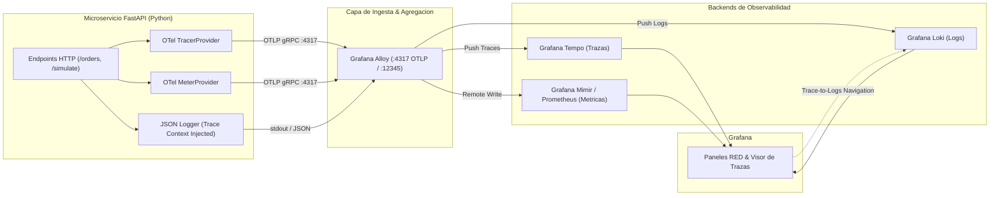

# Microservicio con Instrumentacion OpenTelemetry (OTel) y Grafana


Microservicio de referencia de nivel empresarial desarrollado en **FastAPI** completamente instrumentado con el **SDK de OpenTelemetry (OTel)**. Implementa emision coordinada de los tres pilares de observabilidad mediante **OTLP** (OpenTelemetry Protocol sobre gRPC y HTTP):

1. **Trazas Distribuidas (Distributed Tracing)**: Generacion automatica de spans HTTP y sub-spans manuales para operaciones de base de datos, verificacion de inventario y autorizacion de pagos exportados a **Grafana Tempo** o **Grafana Alloy**.
2. **Logs Estructurados en JSON con Correlacion Nativa (Trace-to-Logs)**: Inyeccion automatizada de `trace_id` y `span_id` en cada registro emitido a `stdout`, permitiendo navegacion cruzada de 1 clic entre trazas y logs en **Grafana Loki**.
3. **Metricas RED (Rate, Errors, Duration)**: Medicion de throughput (`http_requests_total`), histogramas de duracion (`http_request_duration_seconds`) y latencia de base de datos (`db_query_duration_seconds`) exportados a **Prometheus / Mimir**.

---

## Arquitectura de Telemetria



---

## Catalogo de Endpoints y Comportamiento de Trazas

| Metodo | Ruta | Descripcion | Comportamiento del Tracer |
| :--- | :--- | :--- | :--- |
| `GET` | `/health` | Chequeo de salud del servicio | Traza basica con etiquetas de version y entorno. |
| `GET` | `/api/v1/orders` | Consulta de ordenes recientes | Genera span de base de datos `db.query_orders` con sentencias SQL simuladas. |
| `POST` | `/api/v1/orders` | Proceso transaccional completo | Genera cascada de 3 sub-spans: `inventory.verify_stock`, `payment.authorize` y `db.insert_order`. |
| `GET` | `/simulate/slow` | Inyeccion de latencia prolongada | Simula cuello de botella con span de 2.3s para visualizacion de flame graph en Tempo. |
| `GET` | `/simulate/error` | Inyeccion controlada de fallo 500 | Registra excepcion no controlada con span status `ERROR` y evento de stack trace. |

---

## Formato del Log Estructurado (Trace-to-Logs)

Cada log emitido por la aplicacion incluye los identificadores unicos generados por OpenTelemetry:

```json
{
  "timestamp": "2026-09-10T20:45:00.123456Z",
  "level": "INFO",
  "logger": "order-service",
  "message": "Autorizacion de pago por $120.50 confirmada",
  "service.name": "order-processing-service",
  "service.version": "1.0.0",
  "environment": "production",
  "trace_id": "4bf92f3577b34da6a3ce929d0e0e4736",
  "span_id": "00f067aa0ba902b7"
}
```

En Grafana Loki, esto permite enlazar directamente al visor de trazas de Tempo mediante la configuracion de `derivedFields`.

---

## Requisitos Previos

- Python 3.10 o superior.
- Docker y Docker Compose (opcional).

---

## Instalacion y Ejecucion Local

### 1. Clonar el Repositorio
```bash
git clone https://github.com/NeoScraids/otel-microservice-blueprint.git
cd otel-microservice-blueprint
```

### 2. Configurar Entorno Virtual
```bash
python -m venv venv

# En Linux / macOS:
source venv/bin/activate

# En Windows (PowerShell):
.\venv\Scripts\Activate.ps1

pip install -r requirements.txt
```

### 3. Configurar Variables de Entorno
Copia la plantilla `.env.example`:
```bash
cp .env.example .env
```

Variables disponibles:
```env
SERVICE_NAME=order-processing-service
OTEL_EXPORTER_OTLP_ENDPOINT=http://localhost:4317
OTEL_EXPORTER_PROTOCOL=grpc
OTEL_SAMPLING_RATIO=1.0
LOG_LEVEL=INFO
PORT=8080
```

### 4. Iniciar el Microservicio
```bash
uvicorn src.main:app --host 0.0.0.0 --port 8080 --reload
```

---

## Generacion de Trafico y Trazas Sinteticas

Para simular peticiones simultaneas, transacciones exitosas, peticiones con latencia alta y excepciones HTTP 500, ejecuta en una terminal separada:

```bash
python load_generator.py 50
```

Salida esperada:
```text
======================================================================
  GENERADOR DE CARGA DE OBSERVABILIDAD
  Objetivo: http://localhost:8080 | Iteraciones: 50 | Pausa: 0.5s
======================================================================
Conexion establecida. Estado del servicio: healthy

[001/050] POST /api/v1/orders - Estado 200 (0.115s)
[002/050] GET  /api/v1/orders - Estado 200 (0.042s)
[003/050] GET  /simulate/slow - Estado 200 (Latencia prolongada: 2.312s)
[004/050] GET  /simulate/error - Estado 500 (Error intencional provocado)
...
======================================================================
  RESUMEN DE CARGA GENERADA
  Exitosas: 45 | Errores / Excepciones: 5
======================================================================
```

---

## Despliegue con Docker

### Construir la Imagen
```bash
docker build -t neoscraids/otel-microservice-blueprint:1.0.0 .
```

### Ejecutar con Docker Compose
Si dispones de la red `observability-net` creada por `observability-lgtm-stack`:

```bash
docker compose up -d
```

---

## Licencia

Distribuido bajo la licencia MIT. Consulta el archivo `LICENSE` para mas informacion.
